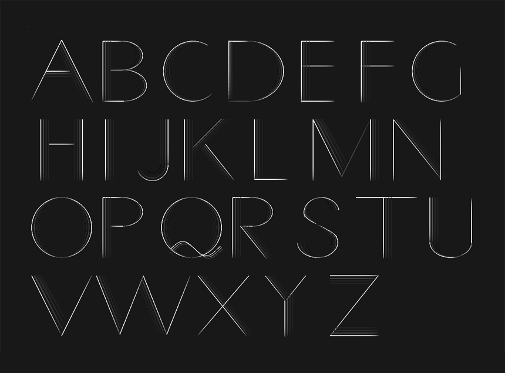

Type deisgn project, animated with [Processing](https://processing.org/), which you can find [here](http://yukinokoh.github.io/processing-type/).

You can embed these letter animation by [following](#usage).


## Structure
- processing 
  - `sketch\_[letter].pde`: Processing code of each letter  
- js 
  - `processing_min.js`: Sister project of Processing designed for the web via [Processing.js](http://processingjs.org/)
- `index.html`: Type animation sample page 
- css
  - `style.css': css for `index.html`
- img
  - `sample.png`: image for README.md
- `LICENSE`
- `README.md`

## Usage
### To embed  
1. Put `sketch_[letter].pde` under your directory

2. Add a pth to `processing_min.js` in head of your html
```html
<script  type="text/javascript" src="[path to processing_min.j]s"></script>
```

3. Add canvas object with *data-processing-sources* attribute where you want 
to embed in your html 
```html
<canvas 
    data-processing-sources="[path to sketch_[letter].pde]">
</canvas>
```

## License
[MIT License](https://choosealicense.com/licenses/mit/) © [Yukino Kohmoto](http://yukinokoh.github.io)
